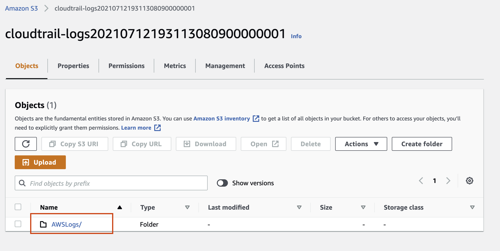
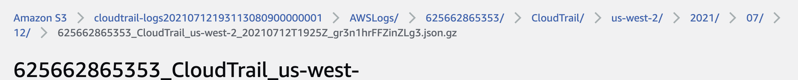
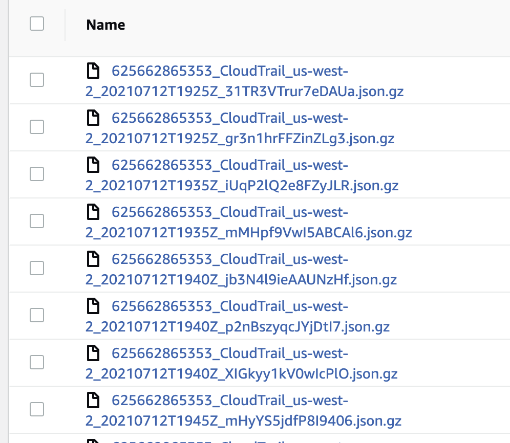

# Requirements:
1. Enable CloudTrail in all regions
2. Enable CloudTrail log validation (done)
3. All management and global events are captured within CloudTrail (done)
4. Store CloudTrail logs are stored in a private s3 bucket (done)
5. Access to the above bucket should also be logged by CloudTrail (done)
6. Integrate CloudTrail with CloudWatch Logs
7. Ensure CloudTrail logs are encrypted at rest using KMS customer managed keys (CMKs) (done)
8. Enable CloudTrail log file integrity validation (done)

# Notes:
- Create s3 private bucket 
- logging to own bucket doesn't work, can create another bucket to save logs to and add those logs to the cloudtrail bucket? 
    - used `event_selector` to enable logging for the bucket
- created kms cmk in the console, which can be imported into our config and used to encrypt/decrypt logs. 
- bucket permissions may cause issues later, `private` vs `log-delivery-write`
    - private = owner has FULL_CONTROL permissions
    - log-delivery-write = LogDelivery group gets WRITE and READ_ACP permissions
        - https://blog.runpanther.io/s3-bucket-security/
        - based on this^ it seems like log-delivery-write is secure enough
- as per gov.uk website, companies must keep records for 6 years from the end of the financial year they relate to, following the same rules to keep logs for 6 years after creation.  `days = 2190`
    - need to confirm that this will delete logs 6 years after input not the bucket itself 6 years after creation
- API calls are 'data events' 
- as per [terraform cloudtrail documentation](https://registry.terraform.io/providers/hashicorp/aws/latest/docs/resources/cloudtrail):
    - "`enable_log_file_validation` - (Optional) Whether log file integrity validation is enabled. Defaults to `false`."
    - it seems requirements number 2 and 8 are identical? 
- bucket policy error, using [the follwing policy](https://docs.aws.amazon.com/awscloudtrail/latest/userguide/create-s3-bucket-policy-for-cloudtrail.html) from AWS docs
- bucket name errors, when I try to use bucket_prefix it breaks the bucket policy. 
    - resolved by creating a seperate bucket policy and applying it to the bucket
- created a vpc (this is a management event) to test if cloudtrail link works:
    - cloudtrail successfully detected the event and logged it, the log is stored in the correct file and encrypted! 
    - 
    - 
- I opened the folders in the `cloudwatch-logs` bucket and downloaded a file, these actions was logged as well: 
    - 
- `CloudTrail-Digest/` directory is present which indicates that the log file integrity validation is working. 
