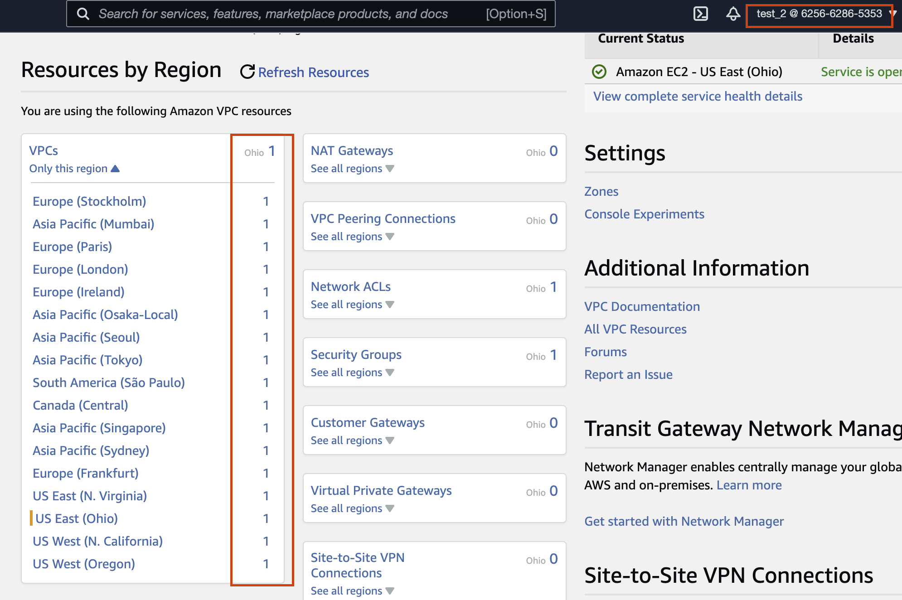
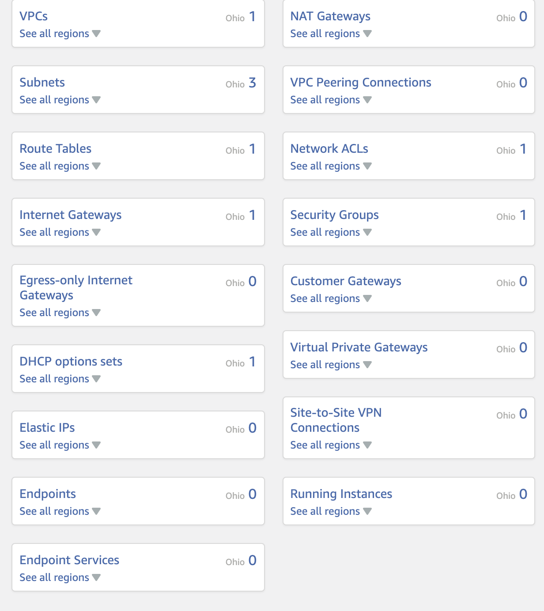
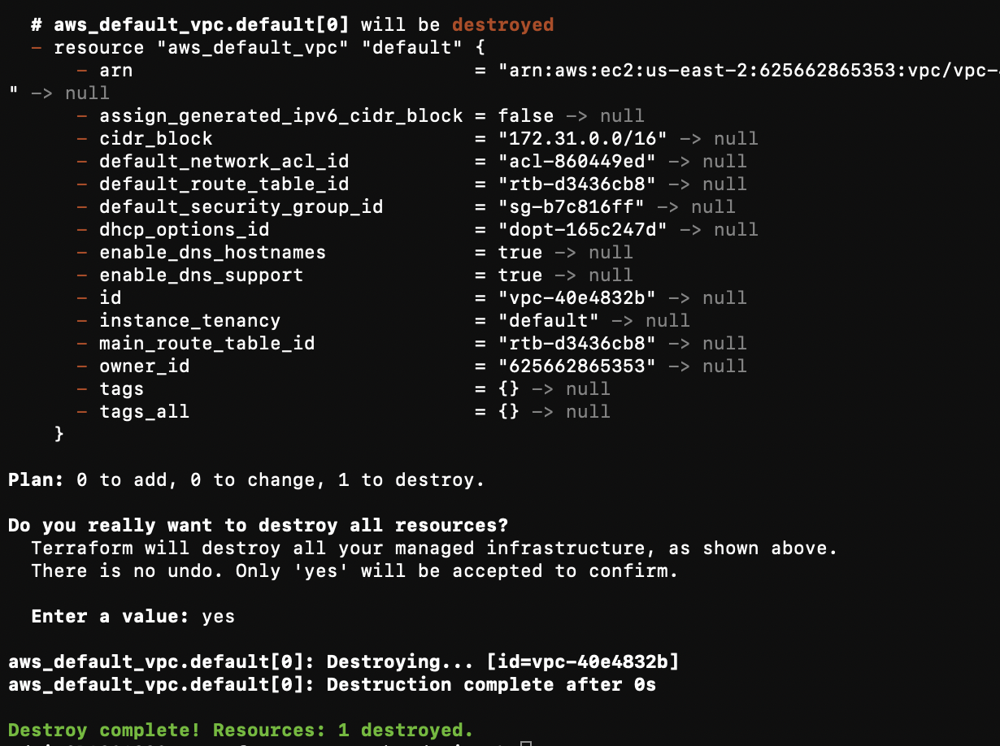
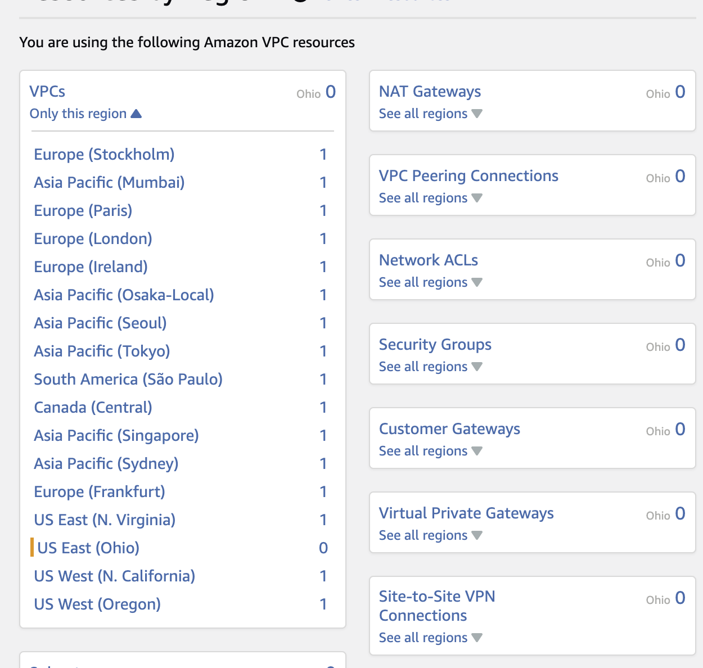

# Requirements
1. Remove default VPC and all associated default network resources in every region of the account. 

## Explanation:
After creating a new IAM user, named 'test_2', in the AWS Consule. I logged on as the user, and went to the 'resources' section of the account. Although I didn't specify a VPN, region or any other infrastructure except the user's permissions, I can see that the user was automatically assigned a VPN in every region. Furthermore, they also have access to the VPN's resources such as subnets and their associated route tables and NACLs in every region.

"As the defaut subnets provide access to the internet, there is a risk that workloads could be deployed directly to these subnets and bypass the network controls in place within the platform that prevent uncontrolled access to the internet" 

**The aim of the policies in this module is that, when attached to an IAM user, they would remove the default VPN and all its associated infrastructure.**

### Notes:
- It is hard for Terraform to remove a VPC that it did not create (you have to trick it into thinking it did)
- tried importing the vpc into terraform then applying with `count = 0` to destroy, which returned success message but didn't actually delete the vpc (checked using AWS console)
- tried importing the vpc then `terraform destroy` which also returned a success message but didn't delete the vpc 
- this could be because of dependencies, might have to manually delete subnets etc. (see image)

- confirmed terraform destroy doesn't handle dependencies well, see [this thread](https://github.com/hashicorp/terraform-provider-aws/issues/2445).
- imported all dependencies (see `imports.sh` file)
- couldn't delete dependencies using `aws_default_*` resource so treated them as non-default resource which worked. However this means I have to define `vpc_id` and `cidr_block` for subnets, plus some other vars. 
- succesfully deleted vpc and all associated infrastructure in one region (`us-east-2`)
    - 
- tested in second region to confirm that only the subnets, vpc, and igw are required for import. 
- Moved terraform script into the default_vpc directory, create python script to loop through regions, can use `boto3` to get vpc_ids, subnet_ids, subnet_cidr and igw_id
- tried to condense subnet resources into one with `count` but didn't work because then it requires `terraform destroy` to delete the subnet. 
- look up terraform `where` clause to explicitly delete subnets / vpc where it's the default, as opposed to filtering in python. 
    - done in boto3 
- test whether subnet cidr is necessary or if can be left blank (`"0.0.0.0/0"`)
    - if it doesn't need to be correct, it makes the python script much easier
- boto3 succesfully used to get a list of all vpcs, subnets and igws. 